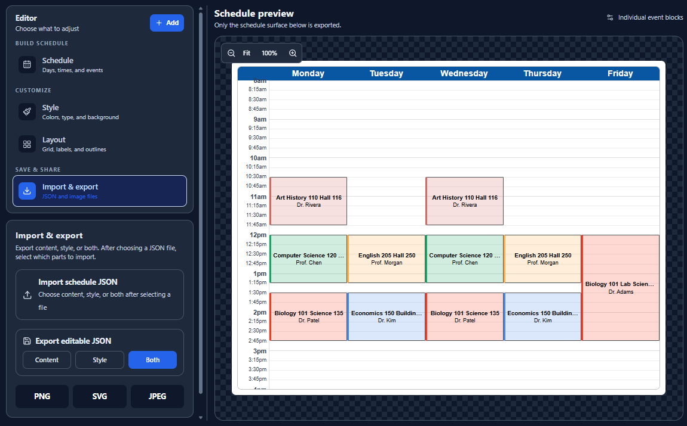

# Weekly Schedule Viewer

A React + Tailwind weekly schedule editor based on San Jose State Unversity's MyScheduler Calender Design.

## Preview Image



## Included

- Monday–Friday weekly calendar based on the MHTML schedule-calendar section
- Add, edit, and delete events/classes
- JSON import/export for content, style/appearance, or both (with import selection)
- PNG, SVG, and JPEG export
- Custom header/footer text
- Weekday header colors and custom font family
- Configurable time increment and visible time range
- Horizontal-line, grid, or no-line backgrounds
- Transparent, solid color, or uploaded image background
- Configurable whole-schedule, calendar, and event-box outlines
- Per-event box and text colors plus default box color
- Configurable block opacity and left accent width
- Optional visual merging of closely spaced same-day events

The editor controls are intentionally outside the export surface. Exported image files contain only the schedule plus its optional custom header/footer.

## Run

```bash
npm install
npm run dev
```

Build for production:

```bash
npm run build
```
